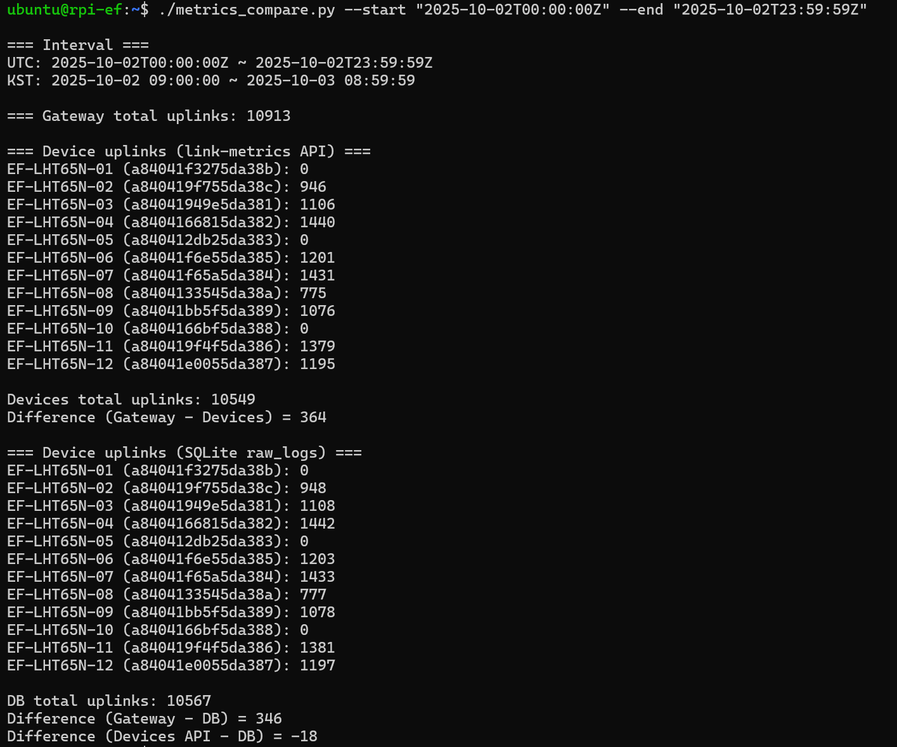

# 📊 Metrics Tools

## 📌 개요

이 도구는 ChirpStack REST API와 SQLite logger 데이터를 기반으로 **Gateway / Device / DB 수신 패킷 수를 비교**하는 유틸리티입니다.
센서 패킷 수신 성공률을 검증하고, 게이트웨이와 DB 저장 구간 사이에서 발생하는 손실 여부를 확인할 수 있습니다.

---

## 📂 폴더 구조

```
services/
 └─ metrics-tools/
     ├─ metrics_compare.py     # 실행 스크립트
     ├─ devices.json           # 디바이스 목록 (devEUI + name)
     ├─ .env.example           # 환경 변수 예시
     └─ README.md              # 설명 문서
```

---

## ⚙️ 사전 준비

### 1. 패키지 설치

시스템 패키지로 Python 라이브러리를 설치합니다:

```bash
sudo apt update
sudo apt install -y python3-requests python3-dotenv
```

또는 `requirements.txt`를 이용할 수 있습니다:

```bash
pip3 install -r requirements.txt
```

### 2. 환경 변수 설정

`.env.example`을 복사하여 `.env` 파일을 작성합니다:

```bash
cp .env.example .env
```

`.env` 예시:

```env
CHIRPSTACK_API_URL=http://100.95.67.20:8090/api
CHIRPSTACK_API_KEY=eyJ0eXAiOiJKV1Qi...
GATEWAY_ID=ac1f09fffe19a7e5
APPLICATION_ID=a0cc862c-126b-4d6a-9f0a-d5438c432d48
SQLITE_DB_PATH=/mnt/nvme/infra/sqlite/sensor_logs.db
```

⚠️ .env 파일은 git에 커밋하지 않고 로컬(RPi)에만 유지하세요.
(예: /home/ubuntu/.envs/onlog-ef-rpi.env 경로에 저장)

### 3. 디바이스 목록 관리

`devices.json`에서 디바이스 이름과 DevEUI를 관리합니다:

```json
[
  { "devEui": "a84041f3275da38b", "name": "EF-LHT65N-01" },
  { "devEui": "a840419f755da38c", "name": "EF-LHT65N-02" }
]
```

---

## 🚀 실행 방법

### 1. 기본 실행 (최근 6시간)

```bash
./metrics_compare.py
```

### 2. 특정 기간 실행

```bash
./metrics_compare.py --start "2025-10-02T00:00:00Z" --end "2025-10-02T23:59:59Z"
```

---

## 📊 출력 예시

```
=== Interval ===
UTC: 2025-10-02T00:00:00Z ~ 2025-10-02T23:59:59Z
KST: 2025-10-02T09:00:00 ~ 2025-10-03T08:59:59

=== Gateway total uplinks: 10913

=== Device uplinks (link-metrics API) ===
EF-LHT65N-02 (a840419f755da38c): 946
EF-LHT65N-03 (a84041949e5da381): 1106
...

Devices total uplinks: 10549
Difference (Gateway - Devices) = 364

=== Device uplinks (SQLite raw_logs) ===
EF-LHT65N-02 (a840419f755da38c): 948
EF-LHT65N-03 (a84041949e5da381): 1108
...

DB total uplinks: 10088
Difference (Gateway - DB) = 825
Difference (Devices API - DB) = 461
```


---

## ✅ 활용 포인트

* 게이트웨이 vs 디바이스 vs DB 카운트 비교 → **수신 손실 구간 파악**
* 주파수별, DR별 분포는 ChirpStack UI/REST API에서 확인 가능
* 장기 보존이 필요하다면 Redis → 외부 DB(InfluxDB 등)로 export 가능
